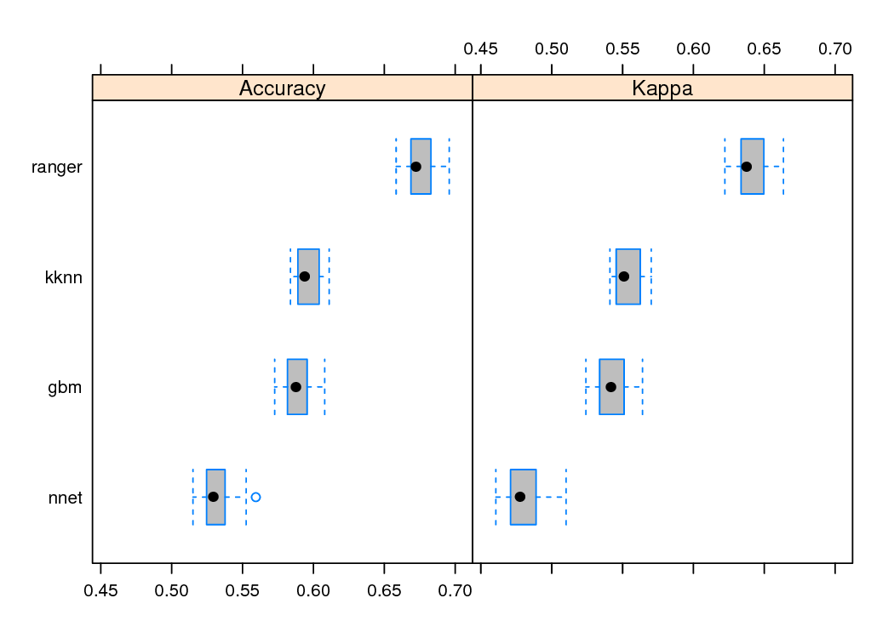
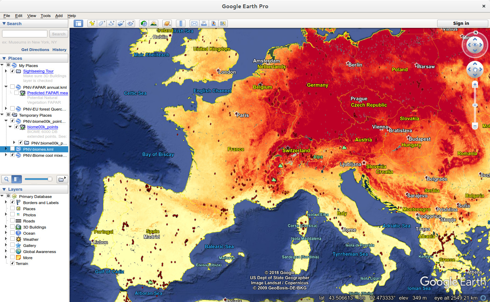

| <a href="https://github.com/thengl"></a> | <a href="https://github.com/mgwalsh"></a>  |
|---|---|

___

<a href="https://creativecommons.org/licenses/by-sa/4.0/" target="_blank"></a>


```{r setup, include=FALSE}
knitr::opts_chunk$set(echo = TRUE)
```

## Introduction

Potential Natural Vegetation (PNV) is “the vegetation cover in equilibrium with climate, that would exist at a given location non-impacted by human activities” [@levavasseur2012statistical;@OstbyeHemsing2012]. It is a hypothetical vegetation state assuming natural (undisturbed) physical conditions, a reference status of vegetation assuming no degradation and/or no unusual ecological disturbances.

This is an R Markdown tutorial explaining basic steps used to produce global and regional maps of Potential Natural Vegetation. We only use a subset of maps and data for this purpose. For more information about the methods used please refer to our paper:

* Hengl T, Walsh MG, Sanderman J, Wheeler I, Harrison SP, Prentice IC. (2018) [**Global mapping of potential natural vegetation: an assessment of Machine Learning algorithms for estimating land potential**](https://doi.org/10.7287/peerj.preprints.26811v2). PeerJ Preprints 6:e26811v1 https://doi.org/10.7287/peerj.preprints.26811v2 (accepted for publication)

## Packages in use

We use a number of packages that range from packages for spatial data to machine learning and species distribution modeling packages. To install all required packages please use:

```{r}
list.of.packages <- c("plyr", "parallel", "plotKML", "GSIF", "ranger", "raster", 
                      "rgdal", "htmlwidgets", "leaflet", "gbm", "nnet", "glmnet", 
                      "doParallel", "dismo", "caret", "devtools", "ggplot2", 
                      "Hmisc", "compositions", "factoextra", "mlr")
new.packages <- list.of.packages[!(list.of.packages %in% installed.packages()[,"Package"])]
if(length(new.packages)) install.packages(new.packages, dependencies = TRUE)
```

In addition, we also use a number of functions produced for the purpose of this project, which you can load by:

```{r}
source("../R_code/PNV_mapping_functions.R")
```

## Mapping the global distribution of biomes

In the first example we look at the global distribution of biomes i.e. most general vegetation / ecosystem types. For modeling we use the [BIOME 6000 point data set](http://dx.doi.org/10.17864/1947.99) [@Harrison2012403], which includes vegetation reconstructions from modern pollen samples, preserved in lake and bog sediments and from moss polsters, soil and other surface deposits. The BIOME 6000 we have previously overlaid against some 160 layers (see [paper](https://doi.org/10.7287/peerj.preprints.26811v2) for full description of environmental layers), so that we on the end get a regression-matrix with 8628 rows and 162 columns:

```{r}
rm.biome.s <- read.csv(gzfile("../Data/Biomes/Biome00k_regression_matrix.csv.gz"))
str(rm.biome.s)
```

The target variable is `Biome00k_c` the corrected biome classes:

```{r}
summary(rm.biome.s$Biome00k_c)
```

and the covariates includes list of climatic, lithological, morphological and similar variables only reflecting biophysical conditions and not human influence or similar.

We can fit a ranger model by using [@Wright2016]:

```{r}
covs.rm.n <- c("Site.Name","admin0","X","Latitude","Longitude",
               "Biome00k_c","esacci.lc.l4","wdpa","bioclimatic.zones")
covs.rm.lst <- -unlist(sapply(covs.rm.n, function(i){grep(i, names(rm.biome.s))}))
covs.lst <- names(rm.biome.s)[covs.rm.lst]
biome00k.fm <- as.formula(paste("Biome00k_c ~ ", paste0(covs.lst, collapse = "+")))
biome00k.fm
m.biome00k <- ranger::ranger(biome00k.fm, rm.biome.s, importance="impurity", 
                             probability=TRUE, num.trees=151, mtry=19, seed = 1)
m.biome00k
```

thus, the average classification accuracy of this model is about 70%. Could this model be improved using some other algorithms? We can test the performance using the caret package functionality [@kuhn2013applied]:

```{r, eval=FALSE, echo=FALSE}
library(caret)
library(doParallel)
cl <- makeCluster(6)
registerDoParallel(cl)
tc <- trainControl(method="repeatedcv", number=5, repeats=2, classProbs=TRUE, 
                   allowParallel=TRUE, verboseIter=TRUE)
tg <- expand.grid(mtry=seq(10, 160, by=8), splitrule=c("gini"), min.node.size=10)
CP.rf <- train(form=biome00k.fm, 
               data=rm.biome.s[complete.cases(rm.biome.s[,all.vars(biome00k.fm)]),], 
               method="ranger", trControl=tc, tuneGrid=tg, na.action=na.omit)
CP.rf
## 0.57
tg2 <- expand.grid(interaction.depth=c(1,2), # Depth of variable interactions
                   n.trees=c(10,20),	        # Num trees to fit
                   shrinkage=c(0.01,0.1),		# Try 2 values for learning rate 
                   n.minobsinnode = 20)
CP.gb <- train(form=biome00k.fm, 
               data=rm.biome.s[complete.cases(rm.biome.s[,all.vars(biome00k.fm)]),], 
               method="gbm", preProc=c("center","scale"), tuneGrid=tg2, trControl=tc, na.action=na.omit)
CP.gb
## 0.52
CP.nn <- train(form=biome00k.fm, 
               data=rm.biome.s[complete.cases(rm.biome.s[,all.vars(biome00k.fm)]),], 
               method="nnet", preProc=c("center","scale"), trControl=tc, na.action=na.omit)
CP.nn
## 0.43
CP.kn <- train(form=biome00k.fm, 
               data=rm.biome[complete.cases(rm.biome[,all.vars(biome00k.fm)]),], 
               method="kknn", preProc=c("center","scale"), trControl=tc, na.action=na.omit)
CP.kn
## 0.51
stopCluster(cl)
closeAllConnections()
biome.results <- resamples(list(ranger=CP.rf, kknn=CP.kn, gbm=CP.gb, nnet=CP.nn))
pdf(file="/data/PNV/img/Fig_boxplot_biomes_accuracy.pdf", width=7, height=5)
bwplot(biome.results, fill="grey")
dev.off()
```

```{r comparison-biomes, echo=FALSE, fig.cap="Predictive performance of the target machine learning algorithms for mapping global distribution of biomes (N=8653). ranger = random forest, kkn = K-nearest neighbors, gbm = Generalized Boosted Regression Models, nnet = Neural networks.", out.width="55%"}

```

This shows that ranger is somewhat more accurate then the competition (at least based on 2 rounds of the 5-fold cross-validation). Comparison of methods to predict PNV biomes could be further extended by using the packages [mlr](https://mlr-org.github.io/mlr/) [@mlr2016] or [SuperLearner](https://cran.r-project.org/package=SuperLearner) (also allows for generating ensemble predictions).

To predict values of biomes we can use a small subest i.e. a 200x200 km tile (`T9998` covers longitudes 14–16 East and latitudes 48–50 North): 

```{r}
grid1km <- readRDS("../tiled/T9998/T9998.rds")
str(grid1km, max.level = 2)
```

this is a `SpatialPixelsDataFrame` object which contains values of all covariates at new locations. We can predict probabilities for each class by using:

```{r}
var.names <- m.biome00k$forest$independent.variable.names
grid1km <- grid1km[complete.cases(grid1km@data),]
biome1km <- predict(m.biome00k, grid1km@data)
str(biome1km)
```

```{r}
attr(biome1km$predictions, "dimnames")[[2]]
```

To plot the results of prediction we can use the plotKML package:

```{r, eval=FALSE}
grid1km$cool.mixed.forest <- biome1km$predictions[, 
                        which(attr(biome1km$predictions, "dimnames")[[2]] == "cool.mixed.forest")]
library(plotKML)
plotKML(grid1km["cool.mixed.forest"], 
        file.name = "Biome00k_M_cool.mixed.forest_T9998.kml", 
        folder.name = "cool.mixed.forest",
        raster_name = "Biome00k_M_cool.mixed.forest_T9998.png",  
        colour_scale=SAGA_pal[[10]])
```

Alternatively you can use the [KML files](http://envirometrix.synology.me:7070/geoserver/web/) pointing to the Geoserver copy of the maps, and which contains the [final predictions of biomes for the whole world](https://www.arcgis.com/apps/MapJournal/index.html?appid=1856322400844a7cab348bccfa4bee76) (see figure below).

```{r ge-preview, echo=FALSE, fig.cap="Predicted probability of cool.mixed.forest displayed in Google Earth.", out.width="100%"}

```

Finally, to determined the mapping accuracy we can also use the Spatial CV technique available via the [mlr package](https://mlr-org.github.io/mlr/articles/tutorial/devel/handling_of_spatial_data.html):

```{r, eval=FALSE}
library(mlr)
rm.biome.s.sp = rm.biome.s[,c("Site.Name","Longitude","Latitude")]
coordinates(rm.biome.s.sp) = ~ Longitude + Latitude
proj4string(rm.biome.s.sp) = "+proj=longlat +datum=WGS84 +ellps=WGS84 +towgs84=0,0,0"
## project to metric coordiantes (Mercator projection):
rm.biome.s.sp = spTransform(rm.biome.s.sp, 
          CRS("+proj=merc +lon_0=0 +lat_ts=0 +x_0=0 +y_0=0 +datum=WGS84 +units=m +ellps=WGS84 +towgs84=0,0,0"))
spatial.task.biome <-  makeClassifTask(id = "Site.Name", 
                                       data = rm.biome.s[,all.vars(biome00k.fm)], 
                                       target = "Biome00k_c", 
                                       coordinates = as.data.frame(rm.biome.s.sp@coords))
learner.rf <- makeLearner("classif.ranger", predict.type = "prob")
library("parallelMap")
parallelStartSocket(parallel::detectCores())
resampling <- makeResampleDesc("SpRepCV", fold = 5, reps = 5)
cv.biome.SP <- resample(learner = learner.rf, 
                        task = spatial.task.biome, 
                        resampling = resampling, 
                        measures = list(acc, wkappa))
## Aggregated Result: acc.test.mean=0.3319514,wkappa.test.mean=0.4548447
```

Which shows that the actual accuracy, totally taking into account spatial clustering of points, is about 35%, hence singificantly lower than what the ranger package reports by default.

## Mapping the global monthly FAPAR

The following example shows how to model PNV FAPAR (Fraction of Absorbed Photosynthetically Active Radiation) monthly values using the global randomly allocated data (based on the intact areas and protected planet maps). This means that we not only model types of PNV, but a quantitative variable connected to PNV. We can load the data by using:

```{r}
rm.fapar.s <- read.csv(gzfile("../Data/FAPAR/FAPAR_regression_matrix.csv.gz"))
str(rm.fapar.s)
```

this is again a regression matrix with same list of covariates as in the previous examples, with the difference that the FAPAR values have been recorded for 12 months (average value based on the Copernicus FAPAR for 2014–2017). We are interested in building a model of the form:

```
FAPAR ~ cm + X1m + X2m + X3 + ... + Xp
```

where `X1m` is the covariate with monthly values (for example precipitation, day-time and night-time temperatures etc), `X3` is the environmental covariates that do not vary through year (e.g. lithology or DEM derivatives), and `cm` is the cosine of the month number. In R syntax:

```{r}
covs.FAPAR <- readRDS("../Data/FAPAR/fm.FAPAR.rds")
fm.FAPAR <- as.formula(paste("FAPAR ~ cMonth + ", 
                  paste0(covs.FAPAR, collapse="+")))
fm.FAPAR
```

this is a rather large regression matrix so we can test its performance also using a 5% random subset:

```{r}
sel.R <- sample.int(nrow(rm.fapar.s), round(nrow(rm.fapar.s)*.05))
m.FAPAR <- ranger::ranger(fm.FAPAR, rm.fapar.s[sel.R,], 
                    importance="impurity", mtry = 29, num.trees=151)
m.FAPAR
```

To further detect which covariates are most important we can use:

```{r}
xl2.P <- as.list(ranger::importance(m.FAPAR))
print(t(data.frame(xl2.P[order(unlist(xl2.P), decreasing=TRUE)[1:20]])))
```

which shows that the total annual precipitation is the most important covariate explaining FAPAR.

To generate predictions per month we can use a previously prepared function:

```{r, eval=FALSE}
pred_FAPAR(i="T9998", gm=m.FAPAR, tile.tbl=tile.tbl)
```

which on the gives 12 months of predicted FAPAR, which we can visualize as a time series:

```{r plot-FAPAR-months, fig.width=9, fig.cap="Predicted values for FAPAR (median value) for 12 months."}
grid1km.F <- list.files("../tiled/T9998", 
                        pattern=glob2rx("FAPAR_*_M_T9998.tif$"), 
                        full.names=TRUE)
m.lst <- c("Jul","Aug","Sep","Oct","Nov","Dec","Jan","Feb","Mar","Apr","May","Jun")
m.n <- sapply(m.lst, function(i){grep(i, grid1km.F)})
spplot(as(raster::stack(grid1km.F[m.n]), "SpatialGridDataFrame"), layout=c(6,2),
      names.attr=m.lst)
```

## References
