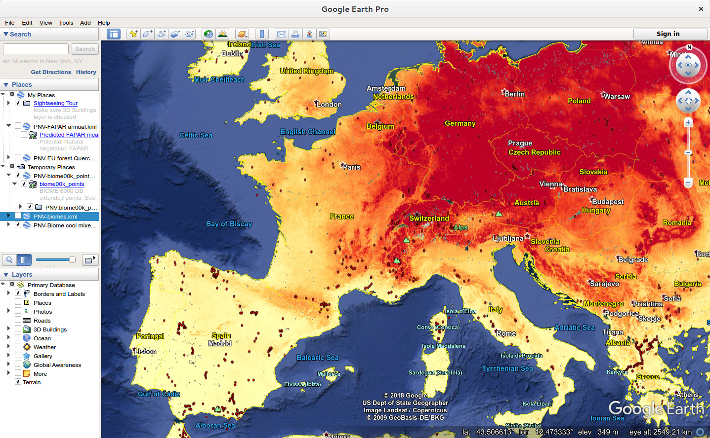

Predictive Mapping of the Potential Natural Vegetation (R tutorial)
================
Hengl, T., and Walsh, M.G.

-   [Introduction](#introduction)
-   [Packages in use](#packages-in-use)
-   [Mapping the global distribution of biomes](#mapping-the-global-distribution-of-biomes)
-   [Mapping the global monthly FAPAR](#mapping-the-global-monthly-fapar)
-   [References](#references)

| <a href="https://github.com/thengl"></a> | <a href="https://github.com/mgwalsh"></a> |
|-------------------------------------------------------------------------------------------------------------------------------------------------|----------------------------------------------------------------------------------------------------------------------------------------------------|

------------------------------------------------------------------------

<a href="https://creativecommons.org/licenses/by-sa/4.0/" target="_blank"></a>

Introduction
------------

Potential Natural Vegetation (PNV) is “the vegetation cover in equilibrium with climate, that would exist at a given location non-impacted by human activities” (Hemsing & Bryn, 2012; Levavasseur, Vrac, Roche, & Paillard, 2012). It is a hypothetical vegetation state assuming natural (undisturbed) physical conditions, a reference status of vegetation assuming no degradation and/or no unusual ecological disturbances.

This is an R Markdown tutorial explaining basic steps used to produce global and regional maps of Potential Natural Vegetation. We only use a subset of maps and data for this purpose. For more information about the methods used please refer to our paper:

-   Hengl T, Walsh MG, Sanderman J, Wheeler I, Harrison SP, Prentice IC. (2018) [**Global mapping of potential natural vegetation: an assessment of Machine Learning algorithms for estimating land potential**](https://doi.org/10.7287/peerj.preprints.26811v2). PeerJ Preprints 6:e26811v1 <https://doi.org/10.7287/peerj.preprints.26811v2> (accepted for publication)

Packages in use
---------------

We use a number of packages that range from packages for spatial data to machine learning and species distribution modeling packages. To install all required packages please use:

``` r
list.of.packages <- c("plyr", "parallel", "plotKML", "GSIF", "ranger", "raster", 
                      "rgdal", "htmlwidgets", "leaflet", "gbm", "nnet", "glmnet", 
                      "doParallel", "dismo", "caret", "devtools", "ggplot2", 
                      "Hmisc", "compositions", "factoextra")
new.packages <- list.of.packages[!(list.of.packages %in% installed.packages()[,"Package"])]
if(length(new.packages)) install.packages(new.packages, dependencies = TRUE)
```

In addition, we also use a number of functions produced for the purpose of this project, which you can load by:

``` r
source("../R_code/PNV_mapping_functions.R")
```

Mapping the global distribution of biomes
-----------------------------------------

In the first example we look at the global distribution of biomes i.e. most general vegetation / ecosystem types. For modeling we use the [BIOME 6000 point data set](http://dx.doi.org/10.17864/1947.99) (Harrison & Bartlein, 2012), which includes vegetation reconstructions from modern pollen samples, preserved in lake and bog sediments and from moss polsters, soil and other surface deposits. The BIOME 6000 we have previously overlaid against some 160 layers (see [paper](https://doi.org/10.7287/peerj.preprints.26811v2) for full description of environmental layers), so that we on the end get a regression-matrix with 8628 rows and 162 columns:

``` r
rm.biome.s <- read.csv(gzfile("../Data/Biomes/Biome00k_regression_matrix.csv.gz"))
str(rm.biome.s)
```

    ## 'data.frame':    8628 obs. of  162 variables:
    ##  $ X                                                                         : int  1 2 3 4 5 6 7 8 9 10 ...
    ##  $ Site.Name                                                                 : Factor w/ 7589 levels "…jamossen","…sbysjšn",..: 291 1578 6798 290 6873 289 288 285 287 282 ...
    ##  $ Biome00k_c                                                                : Factor w/ 20 levels "cold.deciduous.forest",..: 20 11 16 20 16 20 20 17 17 20 ...
    ##  $ Longitude                                                                 : num  30 -78 -67.3 35.5 -57.5 ...
    ##  $ Latitude                                                                  : num  -0.02 -0.03 -0.0388 -0.05 -0.0975 ...
    ##  $ dtm_curvature_merit.dem_m_1km_s0..0cm_2017_v1.0.tif                       : int  -2 -43 -4 -10 -11 -34 -5 -1 -2 -31 ...
    ##  $ dtm_downlslope.curvature_merit.dem_m_1km_s0..0cm_2017_v1.0.tif            : int  -2 -40 -5 -12 -13 -28 -6 1 -1 -43 ...
    ##  $ dtm_dvm_merit.dem_m_1km_s0..0cm_2017_v1.0.tif                             : int  -59 26 -40 -38 -24 -10 -105 -7 -32 49 ...
    ##  $ dtm_dvm2_merit.dem_m_1km_s0..0cm_2017_v1.0.tif                            : int  -66 23 -36 -33 -28 9 -137 -12 -14 72 ...
    ##  $ dtm_elevation_merit.dem_m_1km_s0..0cm_2017_v1.0.tif                       : int  922 3897 84 2476 165 4052 884 972 2333 1303 ...
    ##  $ dtm_mrn_merit.dem_m_1km_s0..0cm_2017_v1.0.tif                             : int  2 16 1 3 6 16 8 3 2 12 ...
    ##  $ dtm_neg.openess_merit.dem_m_1km_s0..0cm_2017_v1.0.tif                     : int  157 150 157 156 156 150 156 157 157 151 ...
    ##  $ dtm_pos.openess_merit.dem_m_1km_s0..0cm_2017_v1.0.tif                     : int  156 152 157 155 156 151 154 156 156 154 ...
    ##  $ dtm_slope_merit.dem_m_1km_s0..0cm_2017_v1.0.tif                           : int  1 14 1 4 4 17 4 1 1 13 ...
    ##  $ dtm_tpi_merit.dem_m_1km_s0..0cm_2017_v1.0.tif                             : int  -2 6 0 -6 0 -8 -11 0 0 11 ...
    ##  $ dtm_twi_merit.dem_m_1km_s0..0cm_2017_v1.0.tif                             : int  110 74 117 94 100 70 102 113 109 85 ...
    ##  $ dtm_upslope.curvature_merit.dem_m_1km_s0..0cm_2017_v1.0.tif               : int  1 17 2 1 9 -3 -6 -1 0 41 ...
    ##  $ dtm_vbf_merit.dem_m_1km_s0..0cm_2017_v1.0.tif                             : int  355 10 796 141 267 3 144 190 394 16 ...
    ##  $ dtm_landform_usgs.ecotapestry.01_p_1km_s0..0cm_2014_v1.0.tif              : int  0 100 0 0 0 100 0 0 0 0 ...
    ##  $ dtm_landform_usgs.ecotapestry.02_p_1km_s0..0cm_2014_v1.0.tif              : int  100 0 100 0 0 0 100 100 100 0 ...
    ##  $ dtm_landform_usgs.ecotapestry.03_p_1km_s0..0cm_2014_v1.0.tif              : int  0 0 0 0 0 0 0 0 0 0 ...
    ##  $ dtm_landform_usgs.ecotapestry.04_p_1km_s0..0cm_2014_v1.0.tif              : int  0 0 0 0 0 0 0 0 0 0 ...
    ##  $ dtm_landform_usgs.ecotapestry.05_p_1km_s0..0cm_2014_v1.0.tif              : int  0 0 0 100 100 0 0 0 0 100 ...
    ##  $ dtm_landform_usgs.ecotapestry.06_p_1km_s0..0cm_2014_v1.0.tif              : int  0 0 0 0 0 0 0 0 0 0 ...
    ##  $ dtm_landform_usgs.ecotapestry.07_p_1km_s0..0cm_2014_v1.0.tif              : int  0 0 0 0 0 0 0 0 0 0 ...
    ##  $ dtm_lithology_usgs.ecotapestry.01_p_1km_s0..0cm_2014_v1.0.tif             : int  0 0 0 0 0 0 0 0 0 0 ...
    ##  $ dtm_lithology_usgs.ecotapestry.02_p_1km_s0..0cm_2014_v1.0.tif             : int  0 0 0 0 0 0 0 0 0 0 ...
    ##  $ dtm_lithology_usgs.ecotapestry.03_p_1km_s0..0cm_2014_v1.0.tif             : int  0 0 0 0 0 0 0 0 0 0 ...
    ##  $ dtm_lithology_usgs.ecotapestry.04_p_1km_s0..0cm_2014_v1.0.tif             : int  0 0 0 0 0 0 100 0 0 0 ...
    ##  $ dtm_lithology_usgs.ecotapestry.05_p_1km_s0..0cm_2014_v1.0.tif             : int  0 0 0 0 0 0 0 0 0 0 ...
    ##  $ dtm_lithology_usgs.ecotapestry.06_p_1km_s0..0cm_2014_v1.0.tif             : int  100 0 0 0 0 0 0 0 0 0 ...
    ##  $ dtm_lithology_usgs.ecotapestry.07_p_1km_s0..0cm_2014_v1.0.tif             : int  0 0 0 0 0 0 0 0 0 0 ...
    ##  $ dtm_lithology_usgs.ecotapestry.08_p_1km_s0..0cm_2014_v1.0.tif             : int  0 0 0 0 0 0 0 0 0 0 ...
    ##  $ dtm_lithology_usgs.ecotapestry.09_p_1km_s0..0cm_2014_v1.0.tif             : int  0 100 0 100 100 100 0 0 100 0 ...
    ##  $ dtm_lithology_usgs.ecotapestry.10_p_1km_s0..0cm_2014_v1.0.tif             : int  0 0 100 0 0 0 0 100 0 100 ...
    ##  $ dtm_lithology_usgs.ecotapestry.11_p_1km_s0..0cm_2014_v1.0.tif             : int  0 0 0 0 0 0 0 0 0 0 ...
    ##  $ dtm_lithology_usgs.ecotapestry.13_p_1km_s0..0cm_2014_v1.0.tif             : int  0 0 0 0 0 0 0 0 0 0 ...
    ##  $ dtm_lithology_usgs.ecotapestry.14_p_1km_s0..0cm_2014_v1.0.tif             : int  0 0 0 0 0 0 0 0 0 0 ...
    ##  $ dtm_lithology_usgs.ecotapestry.15_p_1km_s0..0cm_2014_v1.0.tif             : int  0 0 0 0 0 0 0 0 0 0 ...
    ##  $ dtm_lithology_usgs.ecotapestry.16_p_1km_s0..0cm_2014_v1.0.tif             : int  0 0 0 0 0 0 0 0 0 0 ...
    ##  $ dtm_water.table.depth_deltares_m_1km_b0..150m_2016_v1.0.tif               : int  4 75 2 43 11 44 19 17 8 15 ...
    ##  $ dtm_inundation.extent_giems.d15_m_1km_s0..0cm_2015_v1.0.tif               : int  2 0 0 0 0 3 1 0 0 0 ...
    ##  $ clm_cloud.fraction_earthenv.modis.1_m_1km_s0..0cm_2000..2015_v1.0.tif     : num  6688 8725 7323 4176 7278 ...
    ##  $ clm_cloud.fraction_earthenv.modis.10_m_1km_s0..0cm_2000..2015_v1.0.tif    : int  6938 8692 7710 6624 7085 9412 7093 7896 8519 8402 ...
    ##  $ clm_cloud.fraction_earthenv.modis.11_m_1km_s0..0cm_2000..2015_v1.0.tif    : int  6324 9026 7452 6267 7132 9475 6812 6975 7595 7896 ...
    ##  $ clm_cloud.fraction_earthenv.modis.12_m_1km_s0..0cm_2000..2015_v1.0.tif    : num  6056 9139 7735 4931 7411 ...
    ##  $ clm_cloud.fraction_earthenv.modis.2_m_1km_s0..0cm_2000..2015_v1.0.tif     : int  6737 9286 7904 4819 8321 8363 7227 7266 5107 8061 ...
    ##  $ clm_cloud.fraction_earthenv.modis.3_m_1km_s0..0cm_2000..2015_v1.0.tif     : int  7277 9465 7702 5026 7932 8616 7654 7918 5616 8682 ...
    ##  $ clm_cloud.fraction_earthenv.modis.4_m_1km_s0..0cm_2000..2015_v1.0.tif     : int  8092 9369 7639 6444 8320 9499 8182 8121 7652 8921 ...
    ##  $ clm_cloud.fraction_earthenv.modis.5_m_1km_s0..0cm_2000..2015_v1.0.tif     : int  6605 8364 7871 6187 7262 8956 7088 7314 7335 8341 ...
    ##  $ clm_cloud.fraction_earthenv.modis.6_m_1km_s0..0cm_2000..2015_v1.0.tif     : int  5888 8282 6894 7221 5841 9340 5928 6235 7594 6780 ...
    ##  $ clm_cloud.fraction_earthenv.modis.7_m_1km_s0..0cm_2000..2015_v1.0.tif     : int  5369 7893 7348 8035 5646 9554 5185 5547 7888 6865 ...
    ##  $ clm_cloud.fraction_earthenv.modis.8_m_1km_s0..0cm_2000..2015_v1.0.tif     : int  6172 8526 6860 8392 5509 9768 6467 6993 7983 7779 ...
    ##  $ clm_cloud.fraction_earthenv.modis.9_m_1km_s0..0cm_2000..2015_v1.0.tif     : int  6613 8744 7230 6949 6170 9808 7052 7656 7377 8334 ...
    ##  $ clm_cloud.fraction_earthenv.modis.annual_m_1km_s0..0cm_2000..2015_v1.0.tif: int  6563 8793 7472 6256 6992 9184 6820 7102 7083 7881 ...
    ##  $ clm_snow.prob_esacci.apr_p_1km_s0..0cm_2000..2016_v1.0.tif                : int  0 0 0 0 0 0 0 0 0 0 ...
    ##  $ clm_snow.prob_esacci.aug_p_1km_s0..0cm_2000..2016_v1.0.tif                : int  0 2 0 0 0 1 0 0 0 0 ...
    ##  $ clm_snow.prob_esacci.dec_p_1km_s0..0cm_2000..2016_v1.0.tif                : int  0 5 0 0 0 0 0 0 0 0 ...
    ##  $ clm_snow.prob_esacci.feb_p_1km_s0..0cm_2000..2016_v1.0.tif                : int  0 0 0 0 0 0 0 0 0 0 ...
    ##  $ clm_snow.prob_esacci.jan_p_1km_s0..0cm_2000..2016_v1.0.tif                : int  0 0 0 0 0 0 0 0 0 0 ...
    ##  $ clm_snow.prob_esacci.jul_p_1km_s0..0cm_2000..2016_v1.0.tif                : int  0 0 0 0 0 0 0 0 0 0 ...
    ##  $ clm_snow.prob_esacci.jun_p_1km_s0..0cm_2000..2016_v1.0.tif                : int  0 2 0 0 0 0 0 0 0 0 ...
    ##  $ clm_snow.prob_esacci.mar_p_1km_s0..0cm_2000..2016_v1.0.tif                : int  0 0 0 0 0 0 0 0 0 0 ...
    ##  $ clm_snow.prob_esacci.may_p_1km_s0..0cm_2000..2016_v1.0.tif                : int  0 0 0 0 0 0 0 0 0 0 ...
    ##  $ clm_snow.prob_esacci.nov_p_1km_s0..0cm_2000..2016_v1.0.tif                : int  0 0 0 0 0 0 0 0 0 0 ...
    ##  $ clm_snow.prob_esacci.oct_p_1km_s0..0cm_2000..2016_v1.0.tif                : int  0 0 0 0 0 0 0 0 0 0 ...
    ##  $ clm_snow.prob_esacci.sep_p_1km_s0..0cm_2000..2016_v1.0.tif                : int  0 0 0 0 0 1 0 0 0 0 ...
    ##  $ clm_monthly.temp_worldclim.chelsa.apr_l.01_1km_s0..0cm_1979..2013_v1.0.tif: int  183 28 225 106 223 11 187 181 108 168 ...
    ##  $ clm_monthly.temp_worldclim.chelsa.apr_m_1km_s0..0cm_1979..2013_v1.0.tif   : int  232 67 255 154 255 63 233 226 163 210 ...
    ##  $ clm_monthly.temp_worldclim.chelsa.apr_u.99_1km_s0..0cm_1979..2013_v1.0.tif: int  279 108 285 203 285 116 280 272 217 253 ...
    ##  $ clm_monthly.temp_worldclim.chelsa.aug_l.01_1km_s0..0cm_1979..2013_v1.0.tif: int  184 8 214 85 217 -6 189 184 92 168 ...
    ##  $ clm_monthly.temp_worldclim.chelsa.aug_m_1km_s0..0cm_1979..2013_v1.0.tif   : int  232 58 250 132 259 43 235 232 140 213 ...
    ##  $ clm_monthly.temp_worldclim.chelsa.aug_u.99_1km_s0..0cm_1979..2013_v1.0.tif: int  281 109 285 179 300 93 281 279 189 259 ...
    ##  $ clm_monthly.temp_worldclim.chelsa.dec_l.01_1km_s0..0cm_1979..2013_v1.0.tif: int  181 23 221 92 222 5 184 177 102 163 ...
    ##  $ clm_monthly.temp_worldclim.chelsa.dec_m_1km_s0..0cm_1979..2013_v1.0.tif   : int  226 66 255 145 261 53 227 221 154 205 ...
    ##  $ clm_monthly.temp_worldclim.chelsa.dec_u.99_1km_s0..0cm_1979..2013_v1.0.tif: int  272 109 288 199 300 102 271 266 205 247 ...
    ##  $ clm_monthly.temp_worldclim.chelsa.feb_l.01_1km_s0..0cm_1979..2013_v1.0.tif: int  185 26 225 100 221 1 188 183 102 168 ...
    ##  $ clm_monthly.temp_worldclim.chelsa.feb_m_1km_s0..0cm_1979..2013_v1.0.tif   : int  236 66 255 156 254 59 237 233 163 214 ...
    ##  $ clm_monthly.temp_worldclim.chelsa.feb_u.99_1km_s0..0cm_1979..2013_v1.0.tif: int  287 105 286 211 287 118 286 282 224 259 ...
    ##  $ clm_monthly.temp_worldclim.chelsa.jan_l.01_1km_s0..0cm_1979..2013_v1.0.tif: int  181 26 224 96 222 1 185 180 98 166 ...
    ##  $ clm_monthly.temp_worldclim.chelsa.jan_m_1km_s0..0cm_1979..2013_v1.0.tif   : int  231 66 254 150 255 56 232 228 156 210 ...
    ##  $ clm_monthly.temp_worldclim.chelsa.jan_u.99_1km_s0..0cm_1979..2013_v1.0.tif: int  280 106 285 203 289 112 280 275 215 254 ...
    ##  $ clm_monthly.temp_worldclim.chelsa.jul_l.01_1km_s0..0cm_1979..2013_v1.0.tif: int  182 9 211 85 213 -6 186 180 92 167 ...
    ##  $ clm_monthly.temp_worldclim.chelsa.jul_m_1km_s0..0cm_1979..2013_v1.0.tif   : int  231 57 245 130 251 42 232 227 139 212 ...
    ##  $ clm_monthly.temp_worldclim.chelsa.jul_u.99_1km_s0..0cm_1979..2013_v1.0.tif: int  279 104 278 176 290 91 279 276 186 258 ...
    ##  $ clm_monthly.temp_worldclim.chelsa.jun_l.01_1km_s0..0cm_1979..2013_v1.0.tif: int  180 18 218 92 220 -6 184 176 93 164 ...
    ##  $ clm_monthly.temp_worldclim.chelsa.jun_m_1km_s0..0cm_1979..2013_v1.0.tif   : int  232 61 247 137 253 47 233 226 145 211 ...
    ##  $ clm_monthly.temp_worldclim.chelsa.jun_u.99_1km_s0..0cm_1979..2013_v1.0.tif: int  282 103 276 183 286 101 281 276 199 257 ...
    ##  $ clm_monthly.temp_worldclim.chelsa.mar_l.01_1km_s0..0cm_1979..2013_v1.0.tif: int  186 27 225 104 221 7 188 182 104 168 ...
    ##  $ clm_monthly.temp_worldclim.chelsa.mar_m_1km_s0..0cm_1979..2013_v1.0.tif   : int  236 67 256 158 255 64 234 229 164 212 ...
    ##  $ clm_monthly.temp_worldclim.chelsa.mar_u.99_1km_s0..0cm_1979..2013_v1.0.tif: int  284 107 286 213 288 119 282 277 224 256 ...
    ##  $ clm_monthly.temp_worldclim.chelsa.may_l.01_1km_s0..0cm_1979..2013_v1.0.tif: int  182 26 223 101 223 6 186 178 103 167 ...
    ##  $ clm_monthly.temp_worldclim.chelsa.may_m_1km_s0..0cm_1979..2013_v1.0.tif   : int  232 67 252 147 254 59 233 225 155 211 ...
    ##  $ clm_monthly.temp_worldclim.chelsa.may_u.99_1km_s0..0cm_1979..2013_v1.0.tif: int  281 108 281 194 285 113 280 273 209 255 ...
    ##  $ clm_monthly.temp_worldclim.chelsa.nov_l.01_1km_s0..0cm_1979..2013_v1.0.tif: int  181 22 222 94 226 12 184 177 103 163 ...
    ##  $ clm_monthly.temp_worldclim.chelsa.nov_m_1km_s0..0cm_1979..2013_v1.0.tif   : int  225 66 257 145 268 56 227 220 152 204 ...
    ##  $ clm_monthly.temp_worldclim.chelsa.nov_u.99_1km_s0..0cm_1979..2013_v1.0.tif: int  269 111 292 196 310 102 269 263 201 245 ...
    ##  $ clm_monthly.temp_worldclim.chelsa.oct_l.01_1km_s0..0cm_1979..2013_v1.0.tif: int  182 19 221 94 225 7 185 178 102 164 ...
    ##  $ clm_monthly.temp_worldclim.chelsa.oct_m_1km_s0..0cm_1979..2013_v1.0.tif   : int  227 66 257 146 270 57 229 224 154 206 ...
    ##   [list output truncated]

The target variable is `Biome00k_c` the corrected biome classes:

``` r
summary(rm.biome.s$Biome00k_c)
```

    ##                            cold.deciduous.forest 
    ##                                              201 
    ##                 cold.evergreen.needleleaf.forest 
    ##                                              892 
    ##                 cool.evergreen.needleleaf.forest 
    ##                                              201 
    ##                                cool.mixed.forest 
    ##                                             1549 
    ##                        cool.temperate.rainforest 
    ##                                               95 
    ##                                           desert 
    ##                                              330 
    ##                         erect.dwarf.shrub.tundra 
    ##                                              145 
    ##                        graminoid.and.forb.tundra 
    ##                                              128 
    ##                        low.and.high.shrub.tundra 
    ##                                              393 
    ##                     prostrate.dwarf.shrub.tundra 
    ##                                               11 
    ##                                           steppe 
    ##                                              889 
    ##             temperate.deciduous.broadleaf.forest 
    ##                                              961 
    ##     temperate.evergreen.needleleaf.open.woodland 
    ##                                              307 
    ##     temperate.sclerophyll.woodland.and.shrubland 
    ##                                              154 
    ## tropical.deciduous.broadleaf.forest.and.woodland 
    ##                                              215 
    ##              tropical.evergreen.broadleaf.forest 
    ##                                              333 
    ##                                 tropical.savanna 
    ##                                              291 
    ##         tropical.semi.evergreen.broadleaf.forest 
    ##                                              160 
    ##        warm.temperate.evergreen.and.mixed.forest 
    ##                                              985 
    ##                           xerophytic.woods.scrub 
    ##                                              388

and the covariates includes list of climatic, lithological, morphological and similar variables only reflecting biophysical conditions and not human influence or similar.

We can fit a ranger model by using (Wright & Ziegler, 2017):

``` r
covs.rm.n <- c("Site.Name","admin0","X","Latitude","Longitude",
               "Biome00k_c","esacci.lc.l4","wdpa","bioclimatic.zones")
covs.rm.lst <- -unlist(sapply(covs.rm.n, function(i){grep(i, names(rm.biome.s))}))
covs.lst <- names(rm.biome.s)[covs.rm.lst]
biome00k.fm <- as.formula(paste("Biome00k_c ~ ", paste0(covs.lst, collapse = "+")))
biome00k.fm
```

    ## Biome00k_c ~ dtm_curvature_merit.dem_m_1km_s0..0cm_2017_v1.0.tif + 
    ##     dtm_downlslope.curvature_merit.dem_m_1km_s0..0cm_2017_v1.0.tif + 
    ##     dtm_dvm_merit.dem_m_1km_s0..0cm_2017_v1.0.tif + dtm_dvm2_merit.dem_m_1km_s0..0cm_2017_v1.0.tif + 
    ##     dtm_elevation_merit.dem_m_1km_s0..0cm_2017_v1.0.tif + dtm_mrn_merit.dem_m_1km_s0..0cm_2017_v1.0.tif + 
    ##     dtm_neg.openess_merit.dem_m_1km_s0..0cm_2017_v1.0.tif + dtm_pos.openess_merit.dem_m_1km_s0..0cm_2017_v1.0.tif + 
    ##     dtm_slope_merit.dem_m_1km_s0..0cm_2017_v1.0.tif + dtm_tpi_merit.dem_m_1km_s0..0cm_2017_v1.0.tif + 
    ##     dtm_twi_merit.dem_m_1km_s0..0cm_2017_v1.0.tif + dtm_upslope.curvature_merit.dem_m_1km_s0..0cm_2017_v1.0.tif + 
    ##     dtm_vbf_merit.dem_m_1km_s0..0cm_2017_v1.0.tif + dtm_landform_usgs.ecotapestry.01_p_1km_s0..0cm_2014_v1.0.tif + 
    ##     dtm_landform_usgs.ecotapestry.02_p_1km_s0..0cm_2014_v1.0.tif + 
    ##     dtm_landform_usgs.ecotapestry.03_p_1km_s0..0cm_2014_v1.0.tif + 
    ##     dtm_landform_usgs.ecotapestry.04_p_1km_s0..0cm_2014_v1.0.tif + 
    ##     dtm_landform_usgs.ecotapestry.05_p_1km_s0..0cm_2014_v1.0.tif + 
    ##     dtm_landform_usgs.ecotapestry.06_p_1km_s0..0cm_2014_v1.0.tif + 
    ##     dtm_landform_usgs.ecotapestry.07_p_1km_s0..0cm_2014_v1.0.tif + 
    ##     dtm_lithology_usgs.ecotapestry.01_p_1km_s0..0cm_2014_v1.0.tif + 
    ##     dtm_lithology_usgs.ecotapestry.02_p_1km_s0..0cm_2014_v1.0.tif + 
    ##     dtm_lithology_usgs.ecotapestry.03_p_1km_s0..0cm_2014_v1.0.tif + 
    ##     dtm_lithology_usgs.ecotapestry.04_p_1km_s0..0cm_2014_v1.0.tif + 
    ##     dtm_lithology_usgs.ecotapestry.05_p_1km_s0..0cm_2014_v1.0.tif + 
    ##     dtm_lithology_usgs.ecotapestry.06_p_1km_s0..0cm_2014_v1.0.tif + 
    ##     dtm_lithology_usgs.ecotapestry.07_p_1km_s0..0cm_2014_v1.0.tif + 
    ##     dtm_lithology_usgs.ecotapestry.08_p_1km_s0..0cm_2014_v1.0.tif + 
    ##     dtm_lithology_usgs.ecotapestry.09_p_1km_s0..0cm_2014_v1.0.tif + 
    ##     dtm_lithology_usgs.ecotapestry.10_p_1km_s0..0cm_2014_v1.0.tif + 
    ##     dtm_lithology_usgs.ecotapestry.11_p_1km_s0..0cm_2014_v1.0.tif + 
    ##     dtm_lithology_usgs.ecotapestry.13_p_1km_s0..0cm_2014_v1.0.tif + 
    ##     dtm_lithology_usgs.ecotapestry.14_p_1km_s0..0cm_2014_v1.0.tif + 
    ##     dtm_lithology_usgs.ecotapestry.15_p_1km_s0..0cm_2014_v1.0.tif + 
    ##     dtm_lithology_usgs.ecotapestry.16_p_1km_s0..0cm_2014_v1.0.tif + 
    ##     dtm_water.table.depth_deltares_m_1km_b0..150m_2016_v1.0.tif + 
    ##     dtm_inundation.extent_giems.d15_m_1km_s0..0cm_2015_v1.0.tif + 
    ##     clm_cloud.fraction_earthenv.modis.1_m_1km_s0..0cm_2000..2015_v1.0.tif + 
    ##     clm_cloud.fraction_earthenv.modis.10_m_1km_s0..0cm_2000..2015_v1.0.tif + 
    ##     clm_cloud.fraction_earthenv.modis.11_m_1km_s0..0cm_2000..2015_v1.0.tif + 
    ##     clm_cloud.fraction_earthenv.modis.12_m_1km_s0..0cm_2000..2015_v1.0.tif + 
    ##     clm_cloud.fraction_earthenv.modis.2_m_1km_s0..0cm_2000..2015_v1.0.tif + 
    ##     clm_cloud.fraction_earthenv.modis.3_m_1km_s0..0cm_2000..2015_v1.0.tif + 
    ##     clm_cloud.fraction_earthenv.modis.4_m_1km_s0..0cm_2000..2015_v1.0.tif + 
    ##     clm_cloud.fraction_earthenv.modis.5_m_1km_s0..0cm_2000..2015_v1.0.tif + 
    ##     clm_cloud.fraction_earthenv.modis.6_m_1km_s0..0cm_2000..2015_v1.0.tif + 
    ##     clm_cloud.fraction_earthenv.modis.7_m_1km_s0..0cm_2000..2015_v1.0.tif + 
    ##     clm_cloud.fraction_earthenv.modis.8_m_1km_s0..0cm_2000..2015_v1.0.tif + 
    ##     clm_cloud.fraction_earthenv.modis.9_m_1km_s0..0cm_2000..2015_v1.0.tif + 
    ##     clm_cloud.fraction_earthenv.modis.annual_m_1km_s0..0cm_2000..2015_v1.0.tif + 
    ##     clm_snow.prob_esacci.apr_p_1km_s0..0cm_2000..2016_v1.0.tif + 
    ##     clm_snow.prob_esacci.aug_p_1km_s0..0cm_2000..2016_v1.0.tif + 
    ##     clm_snow.prob_esacci.dec_p_1km_s0..0cm_2000..2016_v1.0.tif + 
    ##     clm_snow.prob_esacci.feb_p_1km_s0..0cm_2000..2016_v1.0.tif + 
    ##     clm_snow.prob_esacci.jan_p_1km_s0..0cm_2000..2016_v1.0.tif + 
    ##     clm_snow.prob_esacci.jul_p_1km_s0..0cm_2000..2016_v1.0.tif + 
    ##     clm_snow.prob_esacci.jun_p_1km_s0..0cm_2000..2016_v1.0.tif + 
    ##     clm_snow.prob_esacci.mar_p_1km_s0..0cm_2000..2016_v1.0.tif + 
    ##     clm_snow.prob_esacci.may_p_1km_s0..0cm_2000..2016_v1.0.tif + 
    ##     clm_snow.prob_esacci.nov_p_1km_s0..0cm_2000..2016_v1.0.tif + 
    ##     clm_snow.prob_esacci.oct_p_1km_s0..0cm_2000..2016_v1.0.tif + 
    ##     clm_snow.prob_esacci.sep_p_1km_s0..0cm_2000..2016_v1.0.tif + 
    ##     clm_monthly.temp_worldclim.chelsa.apr_l.01_1km_s0..0cm_1979..2013_v1.0.tif + 
    ##     clm_monthly.temp_worldclim.chelsa.apr_m_1km_s0..0cm_1979..2013_v1.0.tif + 
    ##     clm_monthly.temp_worldclim.chelsa.apr_u.99_1km_s0..0cm_1979..2013_v1.0.tif + 
    ##     clm_monthly.temp_worldclim.chelsa.aug_l.01_1km_s0..0cm_1979..2013_v1.0.tif + 
    ##     clm_monthly.temp_worldclim.chelsa.aug_m_1km_s0..0cm_1979..2013_v1.0.tif + 
    ##     clm_monthly.temp_worldclim.chelsa.aug_u.99_1km_s0..0cm_1979..2013_v1.0.tif + 
    ##     clm_monthly.temp_worldclim.chelsa.dec_l.01_1km_s0..0cm_1979..2013_v1.0.tif + 
    ##     clm_monthly.temp_worldclim.chelsa.dec_m_1km_s0..0cm_1979..2013_v1.0.tif + 
    ##     clm_monthly.temp_worldclim.chelsa.dec_u.99_1km_s0..0cm_1979..2013_v1.0.tif + 
    ##     clm_monthly.temp_worldclim.chelsa.feb_l.01_1km_s0..0cm_1979..2013_v1.0.tif + 
    ##     clm_monthly.temp_worldclim.chelsa.feb_m_1km_s0..0cm_1979..2013_v1.0.tif + 
    ##     clm_monthly.temp_worldclim.chelsa.feb_u.99_1km_s0..0cm_1979..2013_v1.0.tif + 
    ##     clm_monthly.temp_worldclim.chelsa.jan_l.01_1km_s0..0cm_1979..2013_v1.0.tif + 
    ##     clm_monthly.temp_worldclim.chelsa.jan_m_1km_s0..0cm_1979..2013_v1.0.tif + 
    ##     clm_monthly.temp_worldclim.chelsa.jan_u.99_1km_s0..0cm_1979..2013_v1.0.tif + 
    ##     clm_monthly.temp_worldclim.chelsa.jul_l.01_1km_s0..0cm_1979..2013_v1.0.tif + 
    ##     clm_monthly.temp_worldclim.chelsa.jul_m_1km_s0..0cm_1979..2013_v1.0.tif + 
    ##     clm_monthly.temp_worldclim.chelsa.jul_u.99_1km_s0..0cm_1979..2013_v1.0.tif + 
    ##     clm_monthly.temp_worldclim.chelsa.jun_l.01_1km_s0..0cm_1979..2013_v1.0.tif + 
    ##     clm_monthly.temp_worldclim.chelsa.jun_m_1km_s0..0cm_1979..2013_v1.0.tif + 
    ##     clm_monthly.temp_worldclim.chelsa.jun_u.99_1km_s0..0cm_1979..2013_v1.0.tif + 
    ##     clm_monthly.temp_worldclim.chelsa.mar_l.01_1km_s0..0cm_1979..2013_v1.0.tif + 
    ##     clm_monthly.temp_worldclim.chelsa.mar_m_1km_s0..0cm_1979..2013_v1.0.tif + 
    ##     clm_monthly.temp_worldclim.chelsa.mar_u.99_1km_s0..0cm_1979..2013_v1.0.tif + 
    ##     clm_monthly.temp_worldclim.chelsa.may_l.01_1km_s0..0cm_1979..2013_v1.0.tif + 
    ##     clm_monthly.temp_worldclim.chelsa.may_m_1km_s0..0cm_1979..2013_v1.0.tif + 
    ##     clm_monthly.temp_worldclim.chelsa.may_u.99_1km_s0..0cm_1979..2013_v1.0.tif + 
    ##     clm_monthly.temp_worldclim.chelsa.nov_l.01_1km_s0..0cm_1979..2013_v1.0.tif + 
    ##     clm_monthly.temp_worldclim.chelsa.nov_m_1km_s0..0cm_1979..2013_v1.0.tif + 
    ##     clm_monthly.temp_worldclim.chelsa.nov_u.99_1km_s0..0cm_1979..2013_v1.0.tif + 
    ##     clm_monthly.temp_worldclim.chelsa.oct_l.01_1km_s0..0cm_1979..2013_v1.0.tif + 
    ##     clm_monthly.temp_worldclim.chelsa.oct_m_1km_s0..0cm_1979..2013_v1.0.tif + 
    ##     clm_monthly.temp_worldclim.chelsa.oct_u.99_1km_s0..0cm_1979..2013_v1.0.tif + 
    ##     clm_monthly.temp_worldclim.chelsa.sep_l.01_1km_s0..0cm_1979..2013_v1.0.tif + 
    ##     clm_monthly.temp_worldclim.chelsa.sep_m_1km_s0..0cm_1979..2013_v1.0.tif + 
    ##     clm_monthly.temp_worldclim.chelsa.sep_u.99_1km_s0..0cm_1979..2013_v1.0.tif + 
    ##     clm_water.vapor_nasa.eo.apr_m_1km_s0..0cm_2000..2017_v1.0.tif + 
    ##     clm_water.vapor_nasa.eo.aug_m_1km_s0..0cm_2000..2017_v1.0.tif + 
    ##     clm_water.vapor_nasa.eo.dec_m_1km_s0..0cm_2000..2017_v1.0.tif + 
    ##     clm_water.vapor_nasa.eo.feb_m_1km_s0..0cm_2000..2017_v1.0.tif + 
    ##     clm_water.vapor_nasa.eo.jan_m_1km_s0..0cm_2000..2017_v1.0.tif + 
    ##     clm_water.vapor_nasa.eo.jul_m_1km_s0..0cm_2000..2017_v1.0.tif + 
    ##     clm_water.vapor_nasa.eo.jun_m_1km_s0..0cm_2000..2017_v1.0.tif + 
    ##     clm_water.vapor_nasa.eo.mar_m_1km_s0..0cm_2000..2017_v1.0.tif + 
    ##     clm_water.vapor_nasa.eo.may_m_1km_s0..0cm_2000..2017_v1.0.tif + 
    ##     clm_water.vapor_nasa.eo.nov_m_1km_s0..0cm_2000..2017_v1.0.tif + 
    ##     clm_water.vapor_nasa.eo.oct_m_1km_s0..0cm_2000..2017_v1.0.tif + 
    ##     clm_water.vapor_nasa.eo.sep_m_1km_s0..0cm_2000..2017_v1.0.tif + 
    ##     clm_precipitation_imerge.annual_m_1km_s0..0cm_1980..2017_v1.0.tif + 
    ##     clm_precipitation_imerge.apr_m_1km_s0..0cm_1980..2017_v1.0.tif + 
    ##     clm_precipitation_imerge.aug_m_1km_s0..0cm_1980..2017_v1.0.tif + 
    ##     clm_precipitation_imerge.dec_m_1km_s0..0cm_1980..2017_v1.0.tif + 
    ##     clm_precipitation_imerge.feb_m_1km_s0..0cm_1980..2017_v1.0.tif + 
    ##     clm_precipitation_imerge.jan_m_1km_s0..0cm_1980..2017_v1.0.tif + 
    ##     clm_precipitation_imerge.jul_m_1km_s0..0cm_1980..2017_v1.0.tif + 
    ##     clm_precipitation_imerge.jun_m_1km_s0..0cm_1980..2017_v1.0.tif + 
    ##     clm_precipitation_imerge.mar_m_1km_s0..0cm_1980..2017_v1.0.tif + 
    ##     clm_precipitation_imerge.may_m_1km_s0..0cm_1980..2017_v1.0.tif + 
    ##     clm_precipitation_imerge.nov_m_1km_s0..0cm_1980..2017_v1.0.tif + 
    ##     clm_precipitation_imerge.oct_m_1km_s0..0cm_1980..2017_v1.0.tif + 
    ##     clm_precipitation_imerge.sep_m_1km_s0..0cm_1980..2017_v1.0.tif + 
    ##     dtm_earthquakes.dens_earthquake.usgs_m_1km_s0..0cm_1910..2017_v1.0.tif + 
    ##     lcv_surface.water.occ_gsw.jrc_p_1km_b0..200cm_1984..2016_v1.0.tif + 
    ##     clm_bioclim.var_chelsa.1_m_1km_s0..0cm_1979..2013_v1.0.tif + 
    ##     clm_bioclim.var_chelsa.10_m_1km_s0..0cm_1979..2013_v1.0.tif + 
    ##     clm_bioclim.var_chelsa.11_m_1km_s0..0cm_1979..2013_v1.0.tif + 
    ##     clm_bioclim.var_chelsa.12_m_1km_s0..0cm_1979..2013_v1.0.tif + 
    ##     clm_bioclim.var_chelsa.13_m_1km_s0..0cm_1979..2013_v1.0.tif + 
    ##     clm_bioclim.var_chelsa.14_m_1km_s0..0cm_1979..2013_v1.0.tif + 
    ##     clm_bioclim.var_chelsa.16_m_1km_s0..0cm_1979..2013_v1.0.tif + 
    ##     clm_bioclim.var_chelsa.17_m_1km_s0..0cm_1979..2013_v1.0.tif + 
    ##     clm_bioclim.var_chelsa.2_m_1km_s0..0cm_1979..2013_v1.0.tif + 
    ##     clm_bioclim.var_chelsa.3_m_1km_s0..0cm_1979..2013_v1.0.tif + 
    ##     clm_bioclim.var_chelsa.4_m_1km_s0..0cm_1979..2013_v1.0.tif + 
    ##     clm_bioclim.var_chelsa.5_m_1km_s0..0cm_1979..2013_v1.0.tif + 
    ##     clm_bioclim.var_chelsa.6_m_1km_s0..0cm_1979..2013_v1.0.tif + 
    ##     clm_bioclim.var_chelsa.7_m_1km_s0..0cm_1979..2013_v1.0.tif

``` r
m.biome00k <- ranger::ranger(biome00k.fm, rm.biome.s, importance="impurity", 
                             probability=TRUE, num.trees=151, mtry=19, seed = 1)
m.biome00k
```

    ## Ranger result
    ## 
    ## Call:
    ##  ranger::ranger(biome00k.fm, rm.biome.s, importance = "impurity",      probability = TRUE, num.trees = 151, mtry = 19, seed = 1) 
    ## 
    ## Type:                             Probability estimation 
    ## Number of trees:                  151 
    ## Sample size:                      8628 
    ## Number of independent variables:  139 
    ## Mtry:                             19 
    ## Target node size:                 10 
    ## Variable importance mode:         impurity 
    ## OOB prediction error:             0.3031399

thus, the average classification accuracy of this model is about 70%. Could this model be improved using some other algorithms? We can test the performance using the caret package functionality (Kuhn & Johnson, 2013):


<p class="caption">
Predictive performance of the target machine learning algorithms for mapping global distribution of biomes (N=8653). ranger = random forest, kkn = K-nearest neighbors, gbm = Generalized Boosted Regression Models, nnet = Neural networks.
</p>

This shows that ranger is somewhat more accurate then the competition (at least based on 2 rounds of the 5-fold cross-validation). Comparison of methods to predict PNV biomes could be further extended by using the packages [mlr](https://mlr-org.github.io/mlr/) (Bischl et al., 2016) or [SuperLearner](https://cran.r-project.org/package=SuperLearner) (also allows for generating ensemble predictions).

To predict values of biomes we can use a small subest i.e. a 200x200 km tile (`T9998` covers longitudes 14–16 East and latitudes 48–50 North):

``` r
grid1km <- readRDS("../tiled/T9998/T9998.rds")
str(grid1km, max.level = 2)
```

    ## Loading required package: sp

    ## Formal class 'SpatialPixelsDataFrame' [package "sp"] with 7 slots
    ##   ..@ data       :'data.frame':  56907 obs. of  142 variables:
    ##   ..@ coords.nrs : num(0) 
    ##   ..@ grid       :Formal class 'GridTopology' [package "sp"] with 3 slots
    ##   ..@ grid.index : int [1:56907] 1 2 3 4 5 6 7 8 9 10 ...
    ##   ..@ coords     : num [1:56907, 1:2] 14 14 14 14 14 ...
    ##   .. ..- attr(*, "dimnames")=List of 2
    ##   ..@ bbox       : num [1:2, 1:2] 14 48 16 50
    ##   .. ..- attr(*, "dimnames")=List of 2
    ##   ..@ proj4string:Formal class 'CRS' [package "sp"] with 1 slot

this is a `SpatialPixelsDataFrame` object which contains values of all covariates at new locations. We can predict probabilities for each class by using:

``` r
var.names <- m.biome00k$forest$independent.variable.names
grid1km <- grid1km[complete.cases(grid1km@data),]
biome1km <- predict(m.biome00k, grid1km@data)
str(biome1km)
```

    ## List of 5
    ##  $ predictions              : num [1:56802, 1:20] 0.0114 0.0114 0.0114 0.0114 0.0114 ...
    ##   ..- attr(*, "dimnames")=List of 2
    ##   .. ..$ : NULL
    ##   .. ..$ : chr [1:20] "cold.deciduous.forest" "cold.evergreen.needleleaf.forest" "cool.evergreen.needleleaf.forest" "cool.mixed.forest" ...
    ##  $ num.trees                : num 151
    ##  $ num.independent.variables: num 139
    ##  $ num.samples              : int 56802
    ##  $ treetype                 : chr "Probability estimation"
    ##  - attr(*, "class")= chr "ranger.prediction"

``` r
attr(biome1km$predictions, "dimnames")[[2]]
```

    ##  [1] "cold.deciduous.forest"                           
    ##  [2] "cold.evergreen.needleleaf.forest"                
    ##  [3] "cool.evergreen.needleleaf.forest"                
    ##  [4] "cool.mixed.forest"                               
    ##  [5] "cool.temperate.rainforest"                       
    ##  [6] "desert"                                          
    ##  [7] "erect.dwarf.shrub.tundra"                        
    ##  [8] "graminoid.and.forb.tundra"                       
    ##  [9] "low.and.high.shrub.tundra"                       
    ## [10] "prostrate.dwarf.shrub.tundra"                    
    ## [11] "steppe"                                          
    ## [12] "temperate.deciduous.broadleaf.forest"            
    ## [13] "temperate.evergreen.needleleaf.open.woodland"    
    ## [14] "temperate.sclerophyll.woodland.and.shrubland"    
    ## [15] "tropical.deciduous.broadleaf.forest.and.woodland"
    ## [16] "tropical.evergreen.broadleaf.forest"             
    ## [17] "tropical.savanna"                                
    ## [18] "tropical.semi.evergreen.broadleaf.forest"        
    ## [19] "warm.temperate.evergreen.and.mixed.forest"       
    ## [20] "xerophytic.woods.scrub"

To plot the results of prediction we can use the plotKML package:

``` r
grid1km$cool.mixed.forest <- biome1km$predictions[, 
                        which(attr(biome1km$predictions, "dimnames")[[2]] == "cool.mixed.forest")]
library(plotKML)
plotKML(grid1km["cool.mixed.forest"], 
        file.name = "Biome00k_M_cool.mixed.forest_T9998.kml", 
        folder.name = "cool.mixed.forest",
        raster_name = "Biome00k_M_cool.mixed.forest_T9998.png",  
        colour_scale=SAGA_pal[[10]])
```

Alternatively you can use the [KML files](http://envirometrix.synology.me:7070/geoserver/web/) pointing to the Geoserver copy of the maps, and which contains the [final predictions of biomes for the whole world](https://www.arcgis.com/apps/MapJournal/index.html?appid=1856322400844a7cab348bccfa4bee76) (see figure below).


<p class="caption">
Predicted probability of cool.mixed.forest displayed in Google Earth.
</p>

Finally, to determined the mapping accuracy we can also use the Spatial CV technique available via the [mlr package](https://mlr-org.github.io/mlr/articles/tutorial/devel/handling_of_spatial_data.html):

``` r
library(mlr)
rm.biome.s.sp = rm.biome.s[,c("Site.Name","Longitude","Latitude")]
coordinates(rm.biome.s.sp) = ~ Longitude + Latitude
proj4string(rm.biome.s.sp) = "+proj=longlat +datum=WGS84 +ellps=WGS84 +towgs84=0,0,0"
## project to metric coordiantes (Mercator projection):
rm.biome.s.sp = spTransform(rm.biome.s.sp, 
          CRS("+proj=merc +lon_0=0 +lat_ts=0 +x_0=0 +y_0=0 +datum=WGS84 +units=m +ellps=WGS84 +towgs84=0,0,0"))
spatial.task.biome <-  makeClassifTask(id = "Site.Name", 
                                       data = rm.biome.s[,all.vars(biome00k.fm)], 
                                       target = "Biome00k_c", 
                                       coordinates = as.data.frame(rm.biome.s.sp@coords))
learner.rf <- makeLearner("classif.ranger", predict.type = "prob")
library("parallelMap")
parallelStartSocket(parallel::detectCores())
resampling <- makeResampleDesc("SpRepCV", fold = 5, reps = 5)
cv.biome.SP <- resample(learner = learner.rf, 
                        task = spatial.task.biome, 
                        resampling = resampling, 
                        measures = list(acc, wkappa))
## Aggregated Result: acc.test.mean=0.3319514,wkappa.test.mean=0.4548447
```

Which shows that the actual accuracy, totally taking into account spatial clustering of points, is about 35%, hence singificantly lower than what the ranger package reports by default.

Mapping the global monthly FAPAR
--------------------------------

The following example shows how to model PNV FAPAR (Fraction of Absorbed Photosynthetically Active Radiation) monthly values using the global randomly allocated data (based on the intact areas and protected planet maps). This means that we not only model types of PNV, but a quantitative variable connected to PNV. We can load the data by using:

``` r
rm.fapar.s <- read.csv(gzfile("../Data/FAPAR/FAPAR_regression_matrix.csv.gz"))
str(rm.fapar.s)
```

    ## 'data.frame':    180990 obs. of  73 variables:
    ##  $ X.1                                                                       : int  1 2 3 4 5 6 7 8 9 11 ...
    ##  $ FAPAR                                                                     : int  220 90 91 73 52 26 80 67 232 234 ...
    ##  $ Month                                                                     : int  4 4 4 4 4 4 4 4 4 4 ...
    ##  $ ID                                                                        : Factor w/ 17931 levels "Deserts.10","Deserts.100",..: 6234 6235 7291 8341 9411 10460 11026 11127 11235 6236 ...
    ##  $ cMonth                                                                    : num  -0.5 -0.5 -0.5 -0.5 -0.5 -0.5 -0.5 -0.5 -0.5 -0.5 ...
    ##  $ water.vapor                                                               : int  515 70 54 39 63 64 75 76 597 425 ...
    ##  $ precipitation                                                             : num  208 22 22 17 29 21 26 27 403 238 ...
    ##  $ temp_max                                                                  : num  288 60 -20 -1 11 0 73 65 286 281 ...
    ##  $ temp_mean                                                                 : num  254 -4 -67 -52 -36 -30 12 9 256 244 ...
    ##  $ temp_min                                                                  : num  219 -68 -113 -103 -84 -59 -48 -45 227 208 ...
    ##  $ could.fraction                                                            : num  7474 5332 6447 4351 7394 ...
    ##  $ snow.prob                                                                 : int  0 72 100 100 100 100 70 77 0 0 ...
    ##  $ row.index                                                                 : int  1 2 3 4 5 6 7 8 9 11 ...
    ##  $ LandCover                                                                 : int  1 1 1 1 1 1 1 1 1 1 ...
    ##  $ FAPAR.m                                                                   : int  205 132 90 121 117 114 112 113 232 220 ...
    ##  $ dtm_curvature_merit.dem_m_1km_s0..0cm_2017_v1.0.tif                       : int  -1 -5 -10 -16 -6 -25 -7 -1 -3 -3 ...
    ##  $ dtm_downlslope.curvature_merit.dem_m_1km_s0..0cm_2017_v1.0.tif            : int  -1 -5 -10 -13 -6 -23 -7 -1 -2 -4 ...
    ##  $ dtm_dvm_merit.dem_m_1km_s0..0cm_2017_v1.0.tif                             : int  13 3 -57 -44 -40 11 32 22 25 -51 ...
    ##  $ dtm_dvm2_merit.dem_m_1km_s0..0cm_2017_v1.0.tif                            : int  -19 16 -65 -58 -49 11 37 34 33 -65 ...
    ##  $ dtm_elevation_merit.dem_m_1km_s0..0cm_2017_v1.0.tif                       : int  315 314 409 1128 60 130 359 40 110 559 ...
    ##  $ dtm_mrn_merit.dem_m_1km_s0..0cm_2017_v1.0.tif                             : int  0 1 4 49 3 3 1 0 1 1 ...
    ##  $ dtm_neg.openess_merit.dem_m_1km_s0..0cm_2017_v1.0.tif                     : int  157 157 157 155 157 155 157 157 156 157 ...
    ##  $ dtm_pos.openess_merit.dem_m_1km_s0..0cm_2017_v1.0.tif                     : int  157 157 156 146 156 155 157 157 157 157 ...
    ##  $ dtm_slope_merit.dem_m_1km_s0..0cm_2017_v1.0.tif                           : int  0 2 3 16 3 5 1 0 2 1 ...
    ##  $ dtm_tpi_merit.dem_m_1km_s0..0cm_2017_v1.0.tif                             : int  0 0 -2 -14 -1 0 0 0 1 -1 ...
    ##  $ dtm_twi_merit.dem_m_1km_s0..0cm_2017_v1.0.tif                             : int  117 112 100 72 108 113 111 125 115 117 ...
    ##  $ dtm_upslope.curvature_merit.dem_m_1km_s0..0cm_2017_v1.0.tif               : int  2 3 3 -23 3 14 6 1 4 2 ...
    ##  $ dtm_vbf_merit.dem_m_1km_s0..0cm_2017_v1.0.tif                             : int  988 543 456 10 871 42 717 892 797 594 ...
    ##  $ dtm_landform_usgs.ecotapestry.01_p_1km_s0..0cm_2014_v1.0.tif              : int  0 0 0 0 0 0 0 0 0 0 ...
    ##  $ dtm_landform_usgs.ecotapestry.02_p_1km_s0..0cm_2014_v1.0.tif              : int  100 100 100 0 100 0 0 100 100 100 ...
    ##  $ dtm_landform_usgs.ecotapestry.03_p_1km_s0..0cm_2014_v1.0.tif              : int  0 0 0 0 0 0 0 0 0 0 ...
    ##  $ dtm_landform_usgs.ecotapestry.04_p_1km_s0..0cm_2014_v1.0.tif              : int  0 0 0 0 0 0 0 0 0 0 ...
    ##  $ dtm_landform_usgs.ecotapestry.05_p_1km_s0..0cm_2014_v1.0.tif              : int  0 0 0 0 0 0 0 0 0 0 ...
    ##  $ dtm_landform_usgs.ecotapestry.06_p_1km_s0..0cm_2014_v1.0.tif              : int  0 0 0 0 0 0 0 0 0 0 ...
    ##  $ dtm_landform_usgs.ecotapestry.07_p_1km_s0..0cm_2014_v1.0.tif              : int  0 0 0 100 0 100 100 0 0 0 ...
    ##  $ dtm_lithology_usgs.ecotapestry.01_p_1km_s0..0cm_2014_v1.0.tif             : int  0 100 0 0 0 0 100 0 0 0 ...
    ##  $ dtm_lithology_usgs.ecotapestry.02_p_1km_s0..0cm_2014_v1.0.tif             : int  0 0 0 0 0 0 0 0 0 0 ...
    ##  $ dtm_lithology_usgs.ecotapestry.03_p_1km_s0..0cm_2014_v1.0.tif             : int  0 0 0 0 0 0 0 0 0 0 ...
    ##  $ dtm_lithology_usgs.ecotapestry.04_p_1km_s0..0cm_2014_v1.0.tif             : int  0 0 0 0 0 0 0 0 0 0 ...
    ##  $ dtm_lithology_usgs.ecotapestry.05_p_1km_s0..0cm_2014_v1.0.tif             : int  0 0 0 0 0 0 0 0 0 0 ...
    ##  $ dtm_lithology_usgs.ecotapestry.06_p_1km_s0..0cm_2014_v1.0.tif             : int  0 0 0 0 0 0 0 0 0 0 ...
    ##  $ dtm_lithology_usgs.ecotapestry.07_p_1km_s0..0cm_2014_v1.0.tif             : int  0 0 0 0 0 0 0 0 0 0 ...
    ##  $ dtm_lithology_usgs.ecotapestry.08_p_1km_s0..0cm_2014_v1.0.tif             : int  0 0 0 0 0 0 0 0 0 0 ...
    ##  $ dtm_lithology_usgs.ecotapestry.09_p_1km_s0..0cm_2014_v1.0.tif             : int  0 0 0 0 0 0 0 0 0 0 ...
    ##  $ dtm_lithology_usgs.ecotapestry.10_p_1km_s0..0cm_2014_v1.0.tif             : int  0 0 100 0 0 0 0 0 0 100 ...
    ##  $ dtm_lithology_usgs.ecotapestry.11_p_1km_s0..0cm_2014_v1.0.tif             : int  0 0 0 100 0 0 0 0 100 0 ...
    ##  $ dtm_lithology_usgs.ecotapestry.13_p_1km_s0..0cm_2014_v1.0.tif             : int  0 0 0 0 0 0 0 0 0 0 ...
    ##  $ dtm_lithology_usgs.ecotapestry.14_p_1km_s0..0cm_2014_v1.0.tif             : int  0 0 0 0 0 100 0 0 0 0 ...
    ##  $ dtm_lithology_usgs.ecotapestry.15_p_1km_s0..0cm_2014_v1.0.tif             : int  100 0 0 0 100 0 0 100 0 0 ...
    ##  $ dtm_lithology_usgs.ecotapestry.16_p_1km_s0..0cm_2014_v1.0.tif             : int  0 0 0 0 0 0 0 0 0 0 ...
    ##  $ dtm_water.table.depth_deltares_m_1km_b0..150m_2016_v1.0.tif               : int  5 7 12 12 9 10 6 6 7 8 ...
    ##  $ dtm_inundation.extent_giems.d15_m_1km_s0..0cm_2015_v1.0.tif               : int  1 1 0 0 0 0 1 3 0 0 ...
    ##  $ clm_cloud.fraction_earthenv.modis.annual_m_1km_s0..0cm_2000..2015_v1.0.tif: int  7707 6206 6917 5745 6382 7496 5966 6147 7809 6882 ...
    ##  $ clm_precipitation_imerge.annual_m_1km_s0..0cm_1980..2017_v1.0.tif         : int  1937 535 552 388 527 657 589 590 2957 1989 ...
    ##  $ lcv_admin0_fao.gaul_c_1km_s0..0cm_2015_v1.0.tif                           : int  69 48 48 48 208 208 48 208 198 69 ...
    ##  $ dtm_earthquakes.dens_earthquake.usgs_m_1km_s0..0cm_1910..2017_v1.0.tif    : int  -14 -17 -16 -3 -17 129 -17 -17 -10 -15 ...
    ##  $ lcv_surface.water.occ_gsw.jrc_p_1km_b0..200cm_1984..2016_v1.0.tif         : int  0 0 10 0 0 0 15 0 0 0 ...
    ##  $ clm_bioclim.var_chelsa.1_m_1km_s0..0cm_1979..2013_v1.0.tif                : num  243 -2 -38 -46 -19 6 11 6 249 230 ...
    ##  $ clm_bioclim.var_chelsa.10_m_1km_s0..0cm_1979..2013_v1.0.tif               : num  250 167 118 118 143 122 172 175 254 239 ...
    ##  $ clm_bioclim.var_chelsa.11_m_1km_s0..0cm_1979..2013_v1.0.tif               : num  238 -192 -213 -198 -170 -99 -172 -165 242 221 ...
    ##  $ clm_bioclim.var_chelsa.12_m_1km_s0..0cm_1979..2013_v1.0.tif               : num  1648 623 628 373 527 ...
    ##  $ clm_bioclim.var_chelsa.13_m_1km_s0..0cm_1979..2013_v1.0.tif               : num  200 93 82 73 65 75 87 75 343 217 ...
    ##  $ clm_bioclim.var_chelsa.14_m_1km_s0..0cm_1979..2013_v1.0.tif               : num  40 21 30 13 27 36 21 18 156 53 ...
    ##  $ clm_bioclim.var_chelsa.16_m_1km_s0..0cm_1979..2013_v1.0.tif               : num  571 273 246 197 189 213 251 223 951 613 ...
    ##  $ clm_bioclim.var_chelsa.17_m_1km_s0..0cm_1979..2013_v1.0.tif               : num  138 69 92 41 81 116 73 54 491 194 ...
    ##  $ clm_bioclim.var_chelsa.2_m_1km_s0..0cm_1979..2013_v1.0.tif                : num  43 88 68 66 63 34 87 72 45 48 ...
    ##  $ clm_bioclim.var_chelsa.3_m_1km_s0..0cm_1979..2013_v1.0.tif                : num  664 187 161 166 155 130 191 167 661 617 ...
    ##  $ clm_bioclim.var_chelsa.4_m_1km_s0..0cm_1979..2013_v1.0.tif                : num  443 13135 11919 11869 11259 ...
    ##  $ clm_bioclim.var_chelsa.5_m_1km_s0..0cm_1979..2013_v1.0.tif                : num  275 227 167 164 198 143 228 228 285 277 ...
    ##  $ clm_bioclim.var_chelsa.6_m_1km_s0..0cm_1979..2013_v1.0.tif                : num  210 -243 -253 -231 -206 -120 -224 -204 217 198 ...
    ##  $ clm_bioclim.var_chelsa.7_m_1km_s0..0cm_1979..2013_v1.0.tif                : num  65 471 420 395 404 263 452 432 68 78 ...
    ##  $ X                                                                         : num  17.5 -92.2 -66 -131.3 56.5 ...
    ##  $ Y                                                                         : num  -1.36 52.78 56.36 63.48 65.78 ...

this is again a regression matrix with same list of covariates as in the previous examples, with the difference that the FAPAR values have been recorded for 12 months (average value based on the Copernicus FAPAR for 2014–2017). We are interested in building a model of the form:

    FAPAR ~ cm + X1m + X2m + X3 + ... + Xp

where `X1m` is the covariate with monthly values (for example precipitation, day-time and night-time temperatures etc), `X3` is the environmental covariates that do not vary through year (e.g. lithology or DEM derivatives), and `cm` is the cosine of the month number. In R syntax:

``` r
covs.FAPAR <- readRDS("../Data/FAPAR/fm.FAPAR.rds")
fm.FAPAR <- as.formula(paste("FAPAR ~ cMonth + ", 
                  paste0(covs.FAPAR, collapse="+")))
fm.FAPAR
```

    ## FAPAR ~ cMonth + cMonth + water.vapor + precipitation + temp_max + 
    ##     temp_mean + temp_min + could.fraction + snow.prob + dtm_curvature_merit.dem_m_1km_s0..0cm_2017_v1.0.tif + 
    ##     dtm_downlslope.curvature_merit.dem_m_1km_s0..0cm_2017_v1.0.tif + 
    ##     dtm_dvm_merit.dem_m_1km_s0..0cm_2017_v1.0.tif + dtm_dvm2_merit.dem_m_1km_s0..0cm_2017_v1.0.tif + 
    ##     dtm_elevation_merit.dem_m_1km_s0..0cm_2017_v1.0.tif + dtm_mrn_merit.dem_m_1km_s0..0cm_2017_v1.0.tif + 
    ##     dtm_neg.openess_merit.dem_m_1km_s0..0cm_2017_v1.0.tif + dtm_pos.openess_merit.dem_m_1km_s0..0cm_2017_v1.0.tif + 
    ##     dtm_slope_merit.dem_m_1km_s0..0cm_2017_v1.0.tif + dtm_tpi_merit.dem_m_1km_s0..0cm_2017_v1.0.tif + 
    ##     dtm_twi_merit.dem_m_1km_s0..0cm_2017_v1.0.tif + dtm_upslope.curvature_merit.dem_m_1km_s0..0cm_2017_v1.0.tif + 
    ##     dtm_vbf_merit.dem_m_1km_s0..0cm_2017_v1.0.tif + dtm_landform_usgs.ecotapestry.01_p_1km_s0..0cm_2014_v1.0.tif + 
    ##     dtm_landform_usgs.ecotapestry.02_p_1km_s0..0cm_2014_v1.0.tif + 
    ##     dtm_landform_usgs.ecotapestry.03_p_1km_s0..0cm_2014_v1.0.tif + 
    ##     dtm_landform_usgs.ecotapestry.04_p_1km_s0..0cm_2014_v1.0.tif + 
    ##     dtm_landform_usgs.ecotapestry.05_p_1km_s0..0cm_2014_v1.0.tif + 
    ##     dtm_landform_usgs.ecotapestry.06_p_1km_s0..0cm_2014_v1.0.tif + 
    ##     dtm_landform_usgs.ecotapestry.07_p_1km_s0..0cm_2014_v1.0.tif + 
    ##     dtm_lithology_usgs.ecotapestry.01_p_1km_s0..0cm_2014_v1.0.tif + 
    ##     dtm_lithology_usgs.ecotapestry.02_p_1km_s0..0cm_2014_v1.0.tif + 
    ##     dtm_lithology_usgs.ecotapestry.03_p_1km_s0..0cm_2014_v1.0.tif + 
    ##     dtm_lithology_usgs.ecotapestry.04_p_1km_s0..0cm_2014_v1.0.tif + 
    ##     dtm_lithology_usgs.ecotapestry.05_p_1km_s0..0cm_2014_v1.0.tif + 
    ##     dtm_lithology_usgs.ecotapestry.06_p_1km_s0..0cm_2014_v1.0.tif + 
    ##     dtm_lithology_usgs.ecotapestry.07_p_1km_s0..0cm_2014_v1.0.tif + 
    ##     dtm_lithology_usgs.ecotapestry.08_p_1km_s0..0cm_2014_v1.0.tif + 
    ##     dtm_lithology_usgs.ecotapestry.09_p_1km_s0..0cm_2014_v1.0.tif + 
    ##     dtm_lithology_usgs.ecotapestry.10_p_1km_s0..0cm_2014_v1.0.tif + 
    ##     dtm_lithology_usgs.ecotapestry.11_p_1km_s0..0cm_2014_v1.0.tif + 
    ##     dtm_lithology_usgs.ecotapestry.13_p_1km_s0..0cm_2014_v1.0.tif + 
    ##     dtm_lithology_usgs.ecotapestry.14_p_1km_s0..0cm_2014_v1.0.tif + 
    ##     dtm_lithology_usgs.ecotapestry.15_p_1km_s0..0cm_2014_v1.0.tif + 
    ##     dtm_lithology_usgs.ecotapestry.16_p_1km_s0..0cm_2014_v1.0.tif + 
    ##     dtm_water.table.depth_deltares_m_1km_b0..150m_2016_v1.0.tif + 
    ##     dtm_inundation.extent_giems.d15_m_1km_s0..0cm_2015_v1.0.tif + 
    ##     clm_cloud.fraction_earthenv.modis.annual_m_1km_s0..0cm_2000..2015_v1.0.tif + 
    ##     clm_precipitation_imerge.annual_m_1km_s0..0cm_1980..2017_v1.0.tif + 
    ##     dtm_earthquakes.dens_earthquake.usgs_m_1km_s0..0cm_1910..2017_v1.0.tif + 
    ##     lcv_surface.water.occ_gsw.jrc_p_1km_b0..200cm_1984..2016_v1.0.tif + 
    ##     clm_bioclim.var_chelsa.1_m_1km_s0..0cm_1979..2013_v1.0.tif + 
    ##     clm_bioclim.var_chelsa.10_m_1km_s0..0cm_1979..2013_v1.0.tif + 
    ##     clm_bioclim.var_chelsa.11_m_1km_s0..0cm_1979..2013_v1.0.tif + 
    ##     clm_bioclim.var_chelsa.12_m_1km_s0..0cm_1979..2013_v1.0.tif + 
    ##     clm_bioclim.var_chelsa.13_m_1km_s0..0cm_1979..2013_v1.0.tif + 
    ##     clm_bioclim.var_chelsa.14_m_1km_s0..0cm_1979..2013_v1.0.tif + 
    ##     clm_bioclim.var_chelsa.16_m_1km_s0..0cm_1979..2013_v1.0.tif + 
    ##     clm_bioclim.var_chelsa.17_m_1km_s0..0cm_1979..2013_v1.0.tif + 
    ##     clm_bioclim.var_chelsa.2_m_1km_s0..0cm_1979..2013_v1.0.tif + 
    ##     clm_bioclim.var_chelsa.3_m_1km_s0..0cm_1979..2013_v1.0.tif + 
    ##     clm_bioclim.var_chelsa.4_m_1km_s0..0cm_1979..2013_v1.0.tif + 
    ##     clm_bioclim.var_chelsa.5_m_1km_s0..0cm_1979..2013_v1.0.tif + 
    ##     clm_bioclim.var_chelsa.6_m_1km_s0..0cm_1979..2013_v1.0.tif + 
    ##     clm_bioclim.var_chelsa.7_m_1km_s0..0cm_1979..2013_v1.0.tif

this is a rather large regression matrix so we can test its performance also using a 5% random subset:

``` r
sel.R <- sample.int(nrow(rm.fapar.s), round(nrow(rm.fapar.s)*.05))
m.FAPAR <- ranger::ranger(fm.FAPAR, rm.fapar.s[sel.R,], 
                    importance="impurity", mtry = 29, num.trees=151)
m.FAPAR
```

    ## Ranger result
    ## 
    ## Call:
    ##  ranger::ranger(fm.FAPAR, rm.fapar.s[sel.R, ], importance = "impurity",      mtry = 29, num.trees = 151) 
    ## 
    ## Type:                             Regression 
    ## Number of trees:                  151 
    ## Sample size:                      9050 
    ## Number of independent variables:  63 
    ## Mtry:                             29 
    ## Target node size:                 5 
    ## Variable importance mode:         impurity 
    ## OOB prediction error (MSE):       570.5866 
    ## R squared (OOB):                  0.9064633

To further detect which covariates are most important we can use:

``` r
xl2.P <- as.list(ranger::importance(m.FAPAR))
print(t(data.frame(xl2.P[order(unlist(xl2.P), decreasing=TRUE)[1:20]])))
```

    ##                                                                                  [,1]
    ## clm_precipitation_imerge.annual_m_1km_s0..0cm_1980..2017_v1.0.tif          11910598.5
    ## clm_bioclim.var_chelsa.12_m_1km_s0..0cm_1979..2013_v1.0.tif                 7860574.5
    ## clm_bioclim.var_chelsa.7_m_1km_s0..0cm_1979..2013_v1.0.tif                  5677582.0
    ## clm_bioclim.var_chelsa.2_m_1km_s0..0cm_1979..2013_v1.0.tif                  4336757.3
    ## clm_cloud.fraction_earthenv.modis.annual_m_1km_s0..0cm_2000..2015_v1.0.tif  3699100.9
    ## clm_bioclim.var_chelsa.4_m_1km_s0..0cm_1979..2013_v1.0.tif                  3528891.7
    ## precipitation                                                               2777588.7
    ## clm_bioclim.var_chelsa.16_m_1km_s0..0cm_1979..2013_v1.0.tif                 2018582.3
    ## temp_min                                                                    1953219.4
    ## temp_mean                                                                   1417483.9
    ## clm_bioclim.var_chelsa.5_m_1km_s0..0cm_1979..2013_v1.0.tif                   704539.0
    ## temp_max                                                                     692452.5
    ## clm_bioclim.var_chelsa.10_m_1km_s0..0cm_1979..2013_v1.0.tif                  683397.4
    ## clm_bioclim.var_chelsa.6_m_1km_s0..0cm_1979..2013_v1.0.tif                   669117.0
    ## clm_bioclim.var_chelsa.3_m_1km_s0..0cm_1979..2013_v1.0.tif                   619522.1
    ## water.vapor                                                                  544262.9
    ## clm_bioclim.var_chelsa.14_m_1km_s0..0cm_1979..2013_v1.0.tif                  496581.6
    ## clm_bioclim.var_chelsa.13_m_1km_s0..0cm_1979..2013_v1.0.tif                  410671.9
    ## clm_bioclim.var_chelsa.1_m_1km_s0..0cm_1979..2013_v1.0.tif                   405778.7
    ## clm_bioclim.var_chelsa.17_m_1km_s0..0cm_1979..2013_v1.0.tif                  389579.6

which shows that the total annual precipitation is the most important covariate explaining FAPAR.

To generate predictions per month we can use a previously prepared function:

``` r
pred_FAPAR(i="T9998", gm=m.FAPAR, tile.tbl=tile.tbl)
```

which on the gives 12 months of predicted FAPAR, which we can visualize as a time series:

``` r
grid1km.F <- list.files("../tiled/T9998", 
                        pattern=glob2rx("FAPAR_*_M_T9998.tif$"), 
                        full.names=TRUE)
m.lst <- c("Jul","Aug","Sep","Oct","Nov","Dec","Jan","Feb","Mar","Apr","May","Jun")
m.n <- sapply(m.lst, function(i){grep(i, grid1km.F)})
spplot(as(raster::stack(grid1km.F[m.n]), "SpatialGridDataFrame"), layout=c(6,2),
      names.attr=m.lst)
```


References
----------

Bischl, B., Lang, M., Kotthoff, L., Schiffner, J., Richter, J., Studerus, E., … Jones, Z. M. (2016). mlr: Machine Learning in R. *Journal of Machine Learning Research*, *17*(170), 1–5. Retrieved from <http://jmlr.org/papers/v17/15-066.html>

Harrison, S. P., & Bartlein, P. (2012). Chapter 14 — records from the past, lessons for the future: What the palaeorecord implies about mechanisms of global change. In A. Henderson-Sellers & K. McGuffie (Eds.), *The future of the world’s climate (second edition)* (Second Edition., pp. 403–436). Boston: Elsevier. doi:[https://doi.org/10.1016/B978-0-12-386917-3.00014-2](https://doi.org/https://doi.org/10.1016/B978-0-12-386917-3.00014-2)

Hemsing, L. Østbye, & Bryn, A. (2012). Three methods for modelling potential natural vegetation (pnv) compared: A methodological case study from south-central norway. *Norsk Geografisk Tidsskrift — Norwegian Journal of Geography*, *66*(1), 11–29. doi:[10.1080/00291951.2011.644321](https://doi.org/10.1080/00291951.2011.644321)

Kuhn, M., & Johnson, K. (2013). *Applied predictive modeling* (p. 595). Springer.

Levavasseur, G., Vrac, M., Roche, D., & Paillard, D. (2012). Statistical modelling of a new global potential vegetation distribution. *Environmental Research Letters*, *7*(4), 044019.

Wright, M. N., & Ziegler, A. (2017). ranger: A Fast Implementation of Random Forests for High Dimensional Data in C++ and R. *Journal of Statistical Software*, *7*(1), 18.
